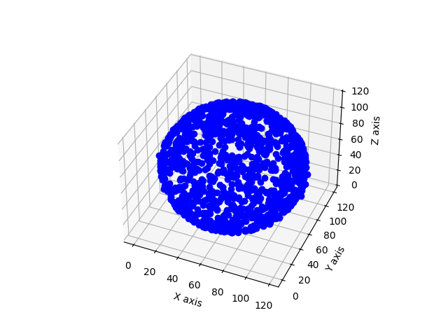

# VisualMedia2024

## Imformation about the paper
**Title** "Instant Neural Grasphics Primitives with a Multiresolution Hash Encoding"\
**Author** Thomas Müller, Alex Evans, Christoph Schied, and Alexander Keller\
**Journal** ACM Transaction on Graphics(TOG), Volume 41, Issue 4\
**Article** No.:102, Pages 1-15\
**URL** https://dl.acm.org/doi/10.1145/3528223.3530127

## Summary
本ページで紹介する **"Instant Neural Grasphics Primitives with a Multiresolution Hash Encoding"** では、Neural Radiance Fields(NeRF)をはじめとする三次元再構成手法に使われるNeural Graphics Primitives(NGP)の位置エンコーディングに注目したものである。オリジナルなNeRF[2]ではfrequency encodingを使用していたのに対し、ここではhash tableを用いた位置エンコーディングを行っている。これによりパラメータを減らし、学習とレンダリングの効率と精度が向上した。

## Implementation and Test
### About Multiresolution Hash Encoding 
ここではNeRFへの利用を考え3次元座標に対するmultiresolution hash encodingを実装した。以下の手順に基づいている。
1. 解像度のレベルの数 $L$ とハッシュテーブルのサイズ $T$ 、特徴ベクトルの次元 $F$ を定める。また、空間の分割数の上限と下限 $(N_{min}\leq N_l\leq N_{max},0\leq l\leq L)$ を定める。ただし $N_l$ は $N_l=\lfloor N_{min}b^l\rfloor,b=exp((\ln N_{max}-\ln N_{min})/(L-1))$ で決定される。
1. 入力される位置座標 $\boldsymbol{x}$ に対し、これが含まれるグリッドの頂点座標をハッシュ関数 $$h(x) = \left( \bigoplus_{i=1}^{d} x_i \pi_i \right) \mod T$$ \
によって $F$ 次元の特徴ベクトルに変換される。ここで $\pi_i$ は論文で使われている $[1,2654435761,805459861]$ という大きな素数を用いている。なお、この特徴ベクトルは後続のネットワークと一緒に学習される。
1. 各頂点の特徴ベクトルが線形補完されることで最終的に入力座標に対応する特徴ベクトルを得る。

この位置エンコーダによって各レベルで $F$ 次元の特徴ベクトルに変換されるから、各座標を $L\cdot F$ 次元の特徴量で表すことになる。

### About Implementation and Test
3次元のmultiresolution hash encoderを実装し、これを使ってある関数 $f(x,y,z)$ を学習タスク実行した。なお、hash encoderの実装には[2]を参考にした。\
ハイパーパラメータは、 $L=16,T=2^8,F=3,N_{min}=4,N_{max}=64$ を使用した。\
学習する領域は $120\times 120\times 120$ の立方体領域で、$f(x,y,z)=(x-x_0)^2+(y-y_0)^2+(z-z_0)^2-r^2$ $(x_0,y_0,z_0)=(60,60,60),r=60$ を学習した。
学習率等これ以外のハイパーパラメータは論文中で使われているものを使用した。
### Result
学習の結果 $f(x,y,z)=0$ の曲面が半径60の球面になっていればよい。今回は解像度が低い空間を使用していることも考慮し、 $f^2<5$ となる格子点を $f(x,y,z)=0$ としてプロットした。
\
隙間が空いているところもあり完ぺきではないものの、教師データとして与えた球面をよく表現しているといえる。
## Key Points on this paper
NeRFが発表された当初も三次元再構成の手法として革新的であったことに違いはないが、学習時間が多くかかってしまうことが問題だった。しかしこの論文のmultiresolution hash talbeを使うことで無駄な解像度部分をスキップするような働きがあり位置的な特徴を効率的にとらえ、論文内では数秒でNeRFの学習が可能になったとしている。\
さらに従来の周波数エンコーディングではベクトルの次元を増やすことでしか高周波成分の学習ができなかったため、精度を高めるためには学習速度を犠牲にする必要があった。逆もまたしかりである。いっぽうでmultiresolution hash encodingでは特徴ベクトルも最適化することで速度と精度をある程度両立できる利点がある。また、各レベルの仕様と特徴ベクトルの初期値を決めるだけでよいことからハイパーパラメータチューニングも簡単になることもこの論文の大きな貢献であるといえる。
## References
[1]Thomas Müller, et al.,"Instant Neural Graphics Primitives with a Multiresolution Hash Encoding",ACM Transaction on Graphics, Volume 41, Issue 4,No.:102, Pages 1-15
https://dl.acm.org/doi/10.1145/3528223.3530127\
[2]Ben Mildenhall, et al.,"NeRF: Representing Scenes as Neural Radiance Fields for View Synthesis",arXiv:2003.08934\
[3]株式会社オプティム"InstantNeRFの心臓、Multiresolution Hash Encodingをシンプルに実装しつつ2次元画像で試してみる"
https://tech-blog.optim.co.jp/entry/2022/04/22/100000#f-0ec67ba2
